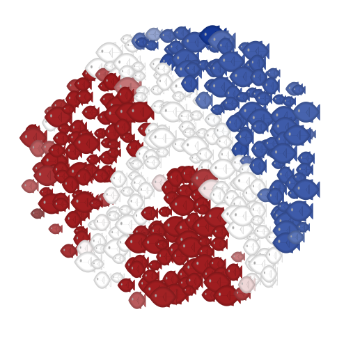
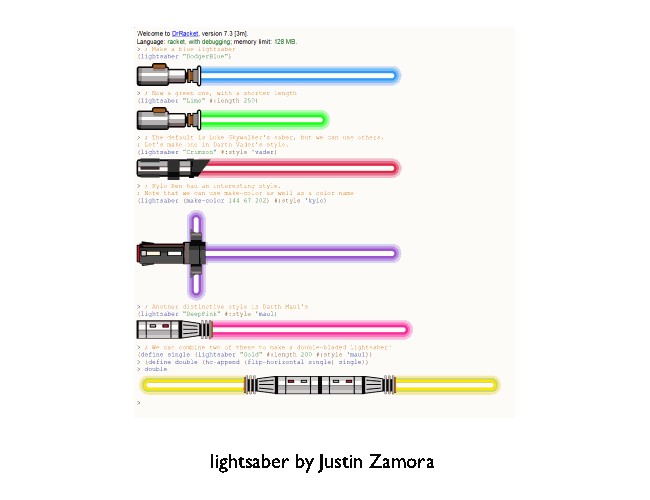

# Creative Racket Competition 2022

*This is a community organised event*

Entries need to be created with Racket or Racket language.
* pictures
* animations 
* interactive
* Sound or music
* Something else?

...are all acceptable.

### Prizes

* Winners will receive an excusive badge on their GitHub profile and laptop stickers. 
* There will be a range of categories to reflect the diversity of entries.

Special prizes for the following categories

* **Racket mascot** - winner will be chosen by peoples choice vote 
* **Racket meme**

## Submissions 

Entries should be submitted as a gist or repo and should be runnable by other racketeers.

[Entry form](https://github.com/standard-fish/racket-creative-graphics-2022/issues/new?assignees=spdegabrielle&labels=&template=submit-competition-entry.md&title=%5BENTRY%5D)

While you choose what licence you prefer for your entries, we would appreciate premission to use entries for the following purposes; promoting Racket Programming Language and community, Racket Programming competitions.

Start date: 1 January 2022

End date: 28 February 2022

**Thank you to Ryan Culpepper for the logo image**: 

